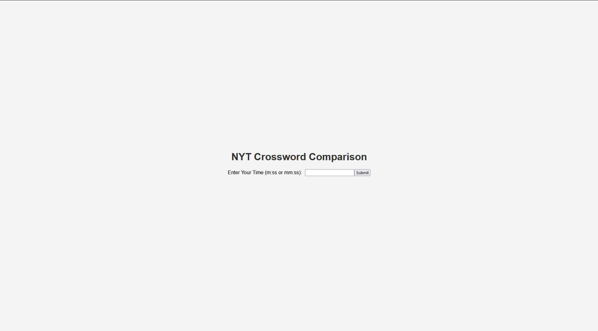
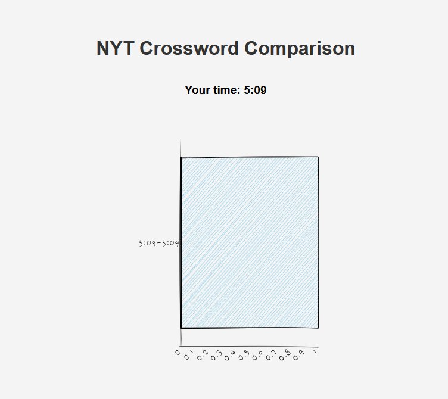

# nyt-crossword-comparison
nyt mini crossword comparison tool

Compare your scores with thousands of others. The idea is that you put in your time to solve the puzzle, and see how it stacks up against everyone else who does the mini crossword that day.

## Running
[Docs](./docs/running.md)

## Screenshots

The scale of the bars automatically adjusts to normally distribute values, e.g. 4:03-4:27 could be a bar when you first enter your time, but could eventually change into 3:70-4:03 as more people enter in values.

**Code is done, just haven't set up heroku yet**

## Running
[Docs](./docs/running.md)

### Heroku

## Screenshots

With time

**My GitHub student pack expired** so I don't want to pay to upload this to heroku or another web service. If anyone is interested in doing this I'd be happy to help.
